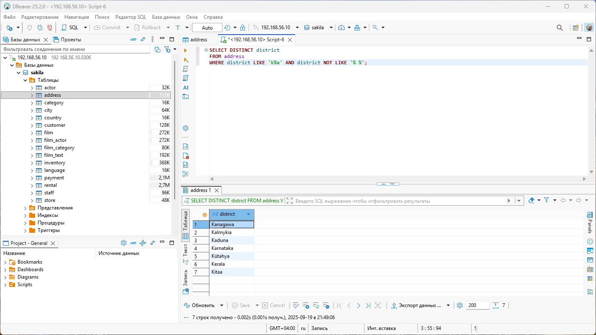
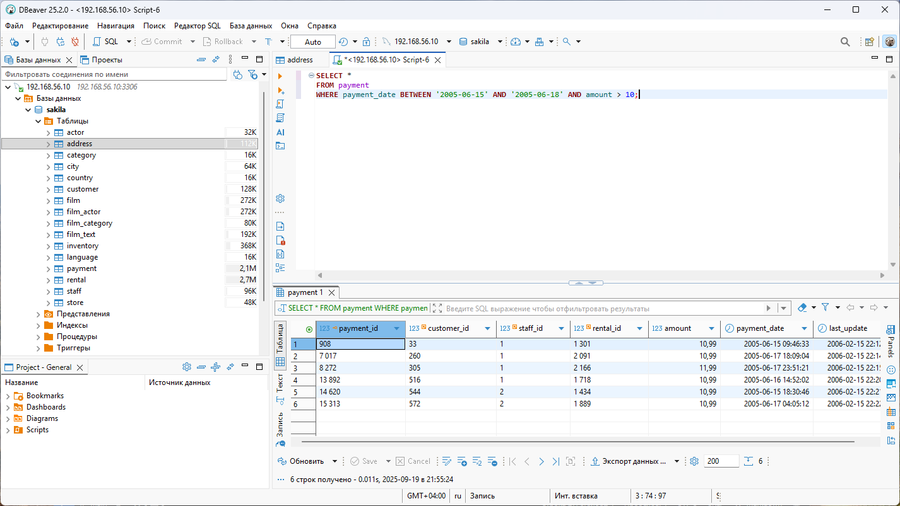
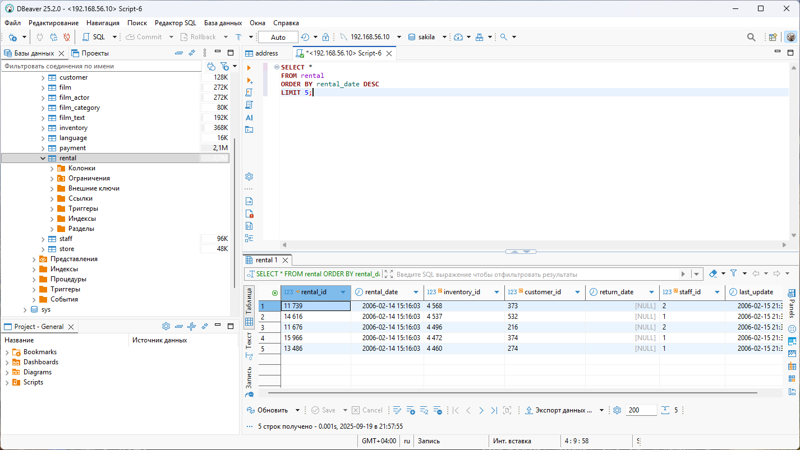
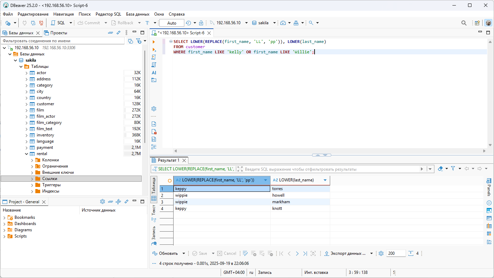
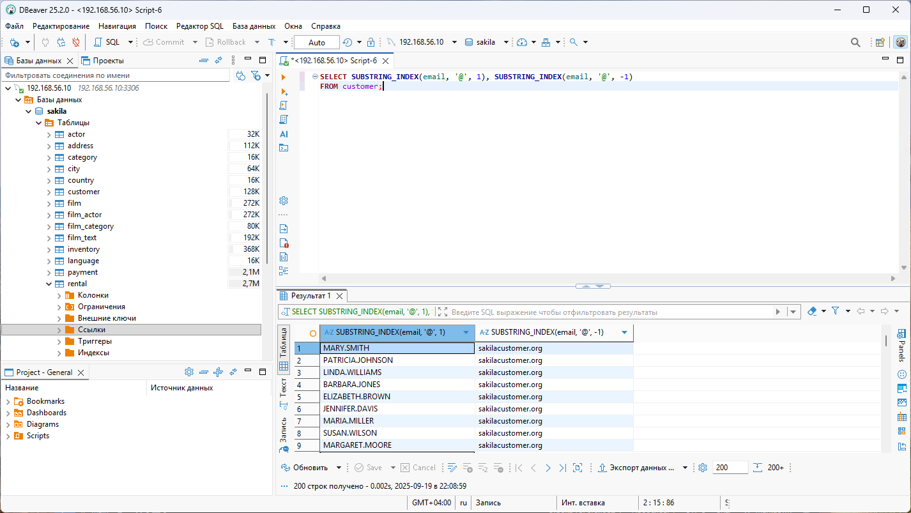
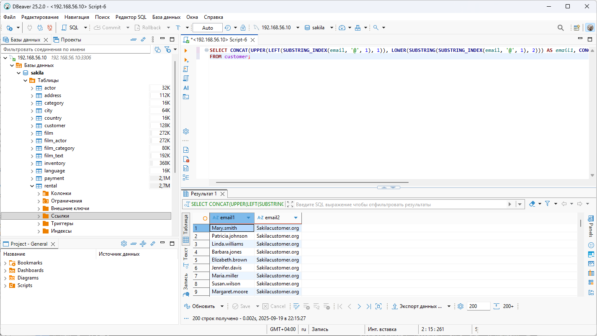

# Домашнее задание к занятию «SQL. Часть 1» - Дьяков Владимир

### Задание 1

Получите уникальные названия районов из таблицы с адресами, которые начинаются на “K” и заканчиваются на “a” и не содержат пробелов.

**Решение:**

```sql
SELECT DISTINCT district
FROM address
WHERE district LIKE 'k%a' AND district NOT LIKE '% %';
```



---

### Задание 2

Получите из таблицы платежей за прокат фильмов информацию по платежам, которые выполнялись в промежуток с 15 июня 2005 года по 18 июня 2005 года **включительно** и стоимость которых превышает 10.00.

**Решение:**

```sql
SELECT *
FROM payment
WHERE payment_date BETWEEN '2005-06-15' AND '2005-06-18' AND amount > 10;
```



---

### Задание 3

Получите последние пять аренд фильмов.

**Решение:**

```sql
SELECT *
FROM rental
ORDER BY rental_date DESC
LIMIT 5;
```



---

### Задание 4

Одним запросом получите активных покупателей, имена которых Kelly или Willie. 

Сформируйте вывод в результат таким образом:
- все буквы в фамилии и имени из верхнего регистра переведите в нижний регистр,
- замените буквы 'll' в именах на 'pp'.

**Решение:**

```sql
SELECT LOWER(REPLACE(first_name, 'LL', 'pp')), LOWER(last_name)
FROM customer
WHERE first_name LIKE 'kelly' OR first_name LIKE 'Willie';
```



---

### Задание 5*

Выведите Email каждого покупателя, разделив значение Email на две отдельных колонки: в первой колонке должно быть значение, указанное до @, во второй — значение, указанное после @.

**Решение:**

```sql
SELECT SUBSTRING_INDEX(email, '@', 1), SUBSTRING_INDEX(email, '@', -1)
FROM customer;
```



---

### Задание 6*

Доработайте запрос из предыдущего задания, скорректируйте значения в новых колонках: первая буква должна быть заглавной, остальные — строчными.

**Решение:**

```sql
SELECT CONCAT(UPPER(LEFT(SUBSTRING_INDEX(email, '@', 1), 1)), LOWER(SUBSTRING(SUBSTRING_INDEX(email, '@', 1), 2))) AS email1, CONCAT(UPPER(LEFT(SUBSTRING_INDEX(email, '@', -1), 1)), LOWER(SUBSTRING(SUBSTRING_INDEX(email, '@', -1), 2))) AS email2
FROM customer;
```

